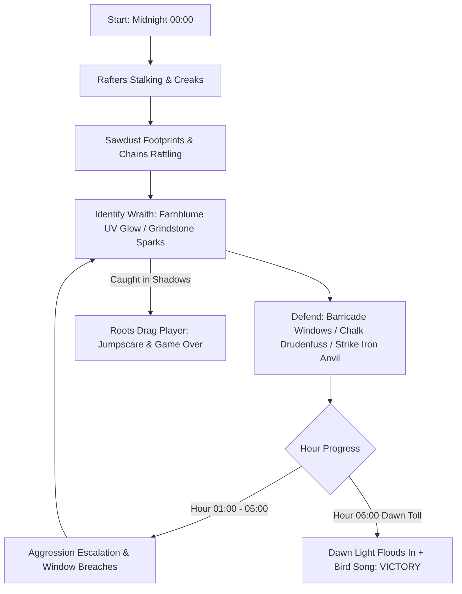

# 🌿 MASTERPLAN: *FARNBLUME (The Fern Flower)*
### *Gothic Black Forest Folk Horror — Jam Execution Roadmap*

> **Theme:** *Survive an Invisible Threat*  
> **Engine:** Godot 4.7 (Forward+, 3D, Jolt Physics)  
> **Release Target:** Windows 64-bit standalone executable via `gh release` (authored & signed exclusively by `soulwax`)  
> **Core Constraint:** **Zero git operations by assistant**. All commits, branching, and repository state managed strictly by the user.

---

## 🎯 Executive Summary & Scope Strategy

The goal is to deliver a terrifying, atmospheric, highly original 7-minute survival horror slice. Instead of generic radar/sonar sci-fi tropes, *Farnblume* derives all tension from **tactile workshop mechanics** and **Germanic dark folklore**:
1. **The Farnblume (UV Lantern):** Bioluminescent flower illuminating the invisible stag-horned wraith in cold violet light.
2. **Sawdust & Shavings Footprints:** Cloven hoofprints stamping into sawdust with spatialized crunch audio.
3. **Grindstone Spark Shower:** Kicking the pedal on `SM_GrindStone` unleashes a fiery spark cone outlining the wraith in glowing embers.
4. **Hour 00:00 to 06:00 Survival Loop:** 6 in-game hours (~75s each = ~7.5 minutes total match). Church bells toll in the distant valley (*fern*) each hour as aggression ramps up until the dawn chorus of birds signals victory.



---

## 🏗️ Architecture & Scene Hierarchy

```
res://
├── Scenes/
│   ├── Main.tscn                      # Game coordinator, atmospheric audio, day-night clock
│   ├── Workshop/
│   │   ├── WorkshopEnvironment.tscn   # Reuses Carpenter's_Workshop.scn + Jolt colliders + fog
│   │   ├── GrindStoneStation.tscn     # Interactive grindstone with GPUParticles3D spark cone
│   │   ├── WindowBreachPoint.tscn     # Breakable shutter windows for plank barricading
│   │   ├── DrudenfussChalkSpot.tscn   # Doorway threshold chalking interaction
│   │   └── AnvilStation.tscn          # Concussive iron bell/anvil stun trigger
│   ├── Player/
│   │   ├── Player.tscn                # First-person CharacterBody3D (headbob, footstep, interact)
│   │   └── Farnblume.tscn             # Held item with SpotLight3D + UV shader beam + wilt meter
│   ├── Monster/
│   │   ├── InvisibleWraith.tscn       # CharacterBody3D + NavigationAgent3D + AudioStreamPlayer3D
│   │   └── Shaders/
│   │       ├── WraithInvis.gdshader   # Refractive distortion (invisible to naked eye)
│   │       └── WraithRevealed.tres    # Antlered root-stalker exposed under Farnblume UV light
│   └── UI/
│       ├── HUD.tscn                   # Clock (Hour roman numerals), Farnblume Petal meter, reticle
│       ├── GameOverScreen.tscn        # Folkloric German epitaph & restart
│       └── VictoryScreen.tscn         # Morning light, bird song, church bell
├── Scripts/
│   ├── GameState.gd                   # Global time manager (00:00 - 06:00), events, hourly bells
│   ├── PlayerController.gd            # Smooth FPS movement, interaction raycast, item management
│   ├── FarnblumeController.gd         # Bloom charge, UV cone collision mask, wilting/reviving
│   ├── WraithAI.gd                    # FSM: Prowl, Stalk, Stalk_Rafters, Spark_Stunned, Repelled, Hunt
│   ├── GrindStone.gd                  # Spark emitter, wraith overlap detector, ember-stick effect
│   └── Interactable.gd                # Base class for all E-key interactions (doors, planks, chalk)
└── Assets/
    ├── LeartesStudios/CarpentersWorkshop/... # (Already imported: meshes, textures, materials)
    └── Audio/Ambiance/...             # (A_Ambiance_DayBirds_001.wav, etc.)
```

---

## ⚡ Fast-Track Implementation Roadmap (4 Rapid Slices)

### Phase 1: The Arena & First-Person Immersion (Hours 1–3)
- [ ] **Player Controller (`Player.tscn`):**
  - Smooth first-person walk/sprint with Jolt `CharacterBody3D`.
  - Mouse look with smooth pitch clamping (-85° to +85°).
  - Diegetic crosshair & interaction raycast (3.0m reach) with outline highlighting.
  - Footstep audio manager with timber creaking sounds.
- [ ] **Workshop Arena Setup:**
  - Instance `Carpenter's_Workshop.scn`.
  - Add Jolt collision hulls to walls, benches, stairs, and floor.
  - Set up `NavigationRegion3D` baked for ground and rafter catwalks.
- [ ] **Volumetric Gothic Environment (`WorldEnvironment`):**
  - Moonlight blue DirectionalLight3D casting sharp shadows through window slats.
  - Forward+ Volumetric Fog enabled: subtle dust motes and cold midnight mist.
  - Dark chiaroscuro interior with a few flickering candle lamps.

### Phase 2: The Invisible Wraith & Sensory Detection (Hours 4–7)
- [ ] **The Farnblume UV Mechanic:**
  - Held flower mesh in left hand emitting a bioluminescent cyan/violet `SpotLight3D`.
  - Flower energy system: slowly wilts when held up continuously (petals droop and light dims); cupping hands (`R` key) or resting it near water bowls (`SM_Jar`) restores vigor.
  - SpotLight detection cone: triggers reveal shader when pointing directly at the Wraith within 8 meters.
- [ ] **Wraith Entity & Dual-Shader System:**
  - Invisible base state: Screen-reading refractive heat-distortion shader with subtle particle leaves drifting down.
  - True form: Gnarled wooden bark silhouette with stag horns. When bathed in UV or sparks, the true mesh flashes into existence.
- [ ] **Sawdust Footprints & Floor Audio:**
  - Wraith footsteps spawn temporary `Decal` cloven hoofprints into wood shavings on the floor.
  - Spatialized `AudioStreamPlayer3D` with dry pine needle / sawdust crunching sound when moving.
- [ ] **Grindstone Spark Station:**
  - Attach `GPUParticles3D` to `SM_GrindStone`.
  - Holding `E` pedals the grindstone, generating a fierce cone of fiery sparks.
  - If the invisible wraith intersects the spark cone:
    - Sparks burst into glowing embers across the wraith's collision volume.
    - Sizzling audio cue plays, stunning the wraith for 2.5 seconds.
- [ ] **Physical Reactions:**
  - Dangling chains (`SM_Hook`) and hanging ceiling lights sway when the wraith glides past.

### Phase 3: The 6-Hour Survival Loop & Defenses (Hours 8–10)
- [ ] **Survival Clock & Difficulty Scaling:**
  - Match duration: 6 in-game hours (~75 seconds real-time per hour = 7.5 min match).
  - Each hour: Valley church bell tolls in the distance.
  - **Hour 0–1:** Stalking from rafters, creaking floorboards, distant hooves.
  - **Hour 2–3:** Wraith actively tests window shutters; starts extinguishing candles.
  - **Hour 4–5:** Window breaches: wraith enters workshop; aggressive hunts.
  - **Hour 6 (06:00 Dawn):** Church chimes ring in full, daylight floods through cracks, wraith shrieks and dissolves into ash.
- [ ] **Workshop Fortification & Countermeasures:**
  - **Window Barricading:** Pick up `SM_Plank_01` and hammer them across rattling shutters to delay entry.
  - **Drudenfuss Chalking:** Chalk traditional Germanic protective pentagram runes across thresholds to block passage for 30 seconds.
  - **Anvil / Workshop Bell Clang:** Hit the iron anvil with a mallet (`SM_Mallet_01`) to emit a concussive shockwave that repels the wraith when trapped in a corner.

### Phase 4: Polish, Diegetic UI, & gh Release (Hours 11–12)
- [ ] **Diegetic UI & Atmosphere:**
  - Brass pocket watch or vintage clock face showing midnight progression.
  - Rapid heartbeat audio & vignette darkening as the wraith closes within kill range.
  - Game Over jumpscare: branch tentacles snap into view, dragging player into darkness.
- [ ] **Sound Design & Foley Polish:**
  - Distant Black Forest wind howling.
  - Timber stress creaks.
  - Victory dawn bird chorus using `Assets/Audio/Ambiance/A_Ambiance_DayBirds_001.wav`.
- [ ] **Release Build Pipeline (`gh release`):**
  - Export preset for Windows Forward+ 64-bit (`fern.exe`).
  - GitHub CLI release script executed strictly with no co-author metadata and under user identity `soulwax`.

---

## 🛠️ GitHub CLI Release Pipeline (No Git Operations)

When the project is ready for release, the build will be generated and uploaded using `gh release create` strictly following the user's constraints:

```powershell
# 1. Export Godot project to build directory (headless)
godot --headless --export-release "Windows Desktop" builds/fern-v1.0.0-windows.zip

# 2. Publish release via GitHub CLI under identity soulwax (no co-authoring, no AI mention)
gh release create v1.0.0 builds/fern-v1.0.0-windows.zip `
    --title "Fern v1.0.0 - Farnblume" `
    --notes "First release of Fern: Farnblume for Gothic & Germanic Game Jam. Developed by soulwax."
```

---

## 📋 Open Decisions & Immediate Next Steps

1. **Catwalk / Rafter Access:** Should the player be able to climb the wooden ladder (`SM_Ladder`) to the upper rafter storage, or keep the player on ground floor while the wraith lurks in the rafters above?
2. **First Action:** We can immediately implement **Phase 1** (Player controller, test movement inside `Carpenter's_Workshop.scn`, and setup the dark Gothic chiaroscuro lighting).
