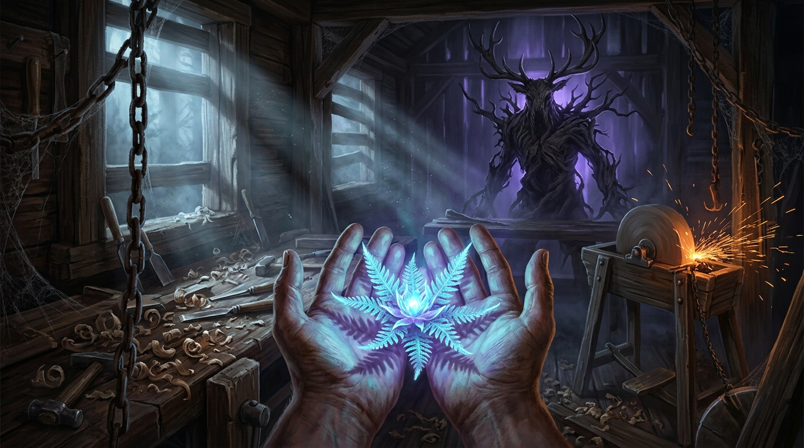

<div align="center">

# 🌿 FERN: FARNBLUME
### *The Fern Flower — A Black Forest Folk Horror Survival Game*

[](https://github.com/soulwax/fern/releases/tag/v1.5.0)
[](https://godotengine.org)
[](https://github.com/godot-jolt/godot-jolt)
[](https://github.com/soulwax/fern/releases/tag/v1.5.0)
[](https://github.com/soulwax)

<br/>



<br/>

**[⬇️ Download Standalone Windows Build (v1.5.0)](https://github.com/soulwax/fern/releases/download/v1.5.0/Fern-v1.5.0-windows-x86_64.zip)** • **[📖 Game Jam Presentation](GAME_JAM_SUBMISSION.md)** • **[📜 Developer Handover](PROJECT_HANDOVER.md)**

</div>

---

## 🌲 The Myth & Lore

> *"In the deepest, suffocating valleys of the 19th-century Black Forest (Schwarzwald), an isolated carpenter plies his trade under the loom of pine trees. On Midsummer Eve (Johannisnacht), the mythical Farnblume (Fern Flower) blooms once every century. To hold it is to perceive that which lies beyond mortal sight. But its sacred bioluminescence also awakens Der Alp—an ancient, invisible forest wraith hungering for the bloom."*

You are the solitary master carpenter. Through the nocturnal ordeal from **00:00 to 06:00**, you must keep the mystical blossom alive by channeling energy through your workshop forge and tools, all while eluding the predatory wraith stalking outside your doors.

---

## ✨ Core Features & Mechanics

- 🌸 **The Handheld Farnblume:** Held in your left hand with living, organic luminescence. Wilt dynamics require constant replenishment at the workshop stations.
- 📷 **19th-Century Daguerreotype Post-Processing:** Custom full-screen film grain shader simulating authentic silver halide grain, claustrophobic radial vignetting, vintage curved glass chromatic aberration, and rich chiaroscuro contrast. Fully toggleable in the Pause Menu.
- 💥 **Grindstone Spark Silhouette Detection:** Turn the grindstone foot pedal to shower the room in fiery sparks. Any sparks striking *Der Alp* ignite glowing embers on its stag-horn body for 3 seconds, stunning the entity and outlining its terrifying silhouette in the dark.
- 🔦 **UV Bioluminescent Bloom (`F` / RMB):** Focus the flower's mystical spectrum ($8\times$ intensity boost) to uncover hidden runes and reveal **cloven hoofprints** etched onto floorboards by *Der Alp*.
- 🕯️ **Candle Stations & Alp Snuffing:** Lit candles ward off the darkness. When *Der Alp* stalks within 3.5m, the candle flutters, snuffs out with rising smoke, and plunges the sector into ice-cold black. Strike a match (`[E]`) to restore holy light.
- 🪜 **Loft Catwalks & Vertical Traversal:** Use interactive ladder stations (`LadderStation.tscn`) to scramble into the elevated storage rafters and drying beams, evading ground pursuit and scouting the workshop layout.
- ⚡ **Dynamic Workshop Stations:** Work the **GrindStoneStation** (sparks cascading from tool sharpening) and **AnvilStation** (rhythmic iron forging) to recharge the blossom's vital essence.
- ⛧ **The Drudenfuss Salt Threshold:** A consecrated pentagram salt barrier shields the entry door. Repair it when breached to deny the wraith free passage.
- 👹 **Visceral Death Jumpscare Cinematic:** Snap-turn camera focus onto *Der Alp*, claw-strike crimson flash, bloodcurdling audio screech, survival telemetry, and the German folkloric epitaph:
  > *"Der Wald nimmt, was sein ist. Deine Knochen nähren die Wurzeln."*
- 🎚️ **3 Difficulty Presets:**
  - **Midsummer Eve (Standard):** Authentic atmospheric balance.
  - **Walpurgisnacht (Nightmare):** 1.5× faster wilt rate, 1.25× wraith sprint speed, aggressive candle snuffing.
  - **Stille Nacht (Story / Explorer):** Relaxed wilt, slower stalk speed for atmospheric enjoyment.
- 🔊 **Rich Foley & Multi-Channel Soundscape:** Resonant hourly church bell chimes with valley acoustic reverb, Black Forest howling wind drafts, metallic anvil rings, and procedural pitch modulation.

---

## 🕹️ Controls Reference

| Input | Action | In-Game Effect |
|:---:|:---:|:---|
| <kbd>W</kbd> <kbd>A</kbd> <kbd>S</kbd> <kbd>D</kbd> | **Movement** | Navigate workshop floor and upper rafters |
| <kbd>Shift</kbd> (Hold) | **Sprint** | Sprint to escape *Der Alp* (uses stamina) |
| <kbd>Space</kbd> | **Jump** | Vault over workshop clutter and beams |
| <kbd>Mouse</kbd> | **Look** | Smooth 3D first-person camera control |
| <kbd>F</kbd> / <kbd>Right Click</kbd> | **UV Bloom** | Flare flower's light; reveal hoofprints & runes |
| <kbd>E</kbd> / <kbd>Left Click</kbd> | **Interact** | Work forge stations, relight candles, climb ladders |
| <kbd>R</kbd> | **Cup Hands** | Shelter the flower blossom to conserve energy |
| <kbd>F11</kbd> | **Toggle Fullscreen** | Instant exclusive/windowed fullscreen switch |
| <kbd>Esc</kbd> | **Pause** | Access options, controls, and return to menu |

---

## 📦 Releases & Downloads

Every standalone release archive is self-contained and pre-configured for Windows x86_64, including the standalone executable, quickstart manual, promotional key art, and folklore manifesto.

| Version | Status | Highlights | Download |
|:---|:---:|:---|:---:|
| **v1.5.0** | 🌟 **Latest** | **Daguerreotype & Spark Silhouette:** 19th-century silver halide film grain shader, Grindstone spark wraith ignition & outline, bloom recharge | [ZIP (275 MB)](https://github.com/soulwax/fern/releases/download/v1.5.0/Fern-v1.5.0-windows-x86_64.zip) |
| **v1.4.0** | Stable | **Audio & Graphics Settings:** Multi-channel audio bus layout with valley reverb, Forward+ TAA, VSync, in-game audio channels & F11 fullscreen | [ZIP (275 MB)](https://github.com/soulwax/fern/releases/download/v1.4.0/Fern-v1.4.0-windows-x86_64.zip) |
| **v1.3.0** | Stable | **Definitive Jam Edition:** High-res key art, complete jam presentation page, full audio foley suite | [ZIP (274 MB)](https://github.com/soulwax/fern/releases/download/v1.3.0/Fern-v1.3.0-windows-x86_64.zip) |
| **v1.2.0** | Stable | Difficulty presets (Midsummer, Walpurgisnacht, Stille Nacht), death jumpscare cinematic & epitaph | [ZIP (303 MB)](https://github.com/soulwax/fern/releases/download/v1.2.0/Fern-v1.2.0-windows-x86_64.zip) |
| **v1.1.0** | Stable | Candle snuffing & relighting, loft catwalks, ladder climbing, howling wind loop | [ZIP (303 MB)](https://github.com/soulwax/fern/releases/download/v1.1.0/Fern-v1.1.0-windows-x86_64.zip) |
| **v1.0.0** | Initial | Initial release featuring workshop arena, Farnblume UV bloom, and wraith AI | [ZIP (302 MB)](https://github.com/soulwax/fern/releases/download/v1.0.0/Fern-v1.0.0-windows-x86_64.zip) |


---

## 🛠️ Building & Running from Source

### Prerequisites
- [Godot Engine 4.7 Forward+](https://godotengine.org/download) (or official Windows 64-bit release build)
- [Godot Jolt 3D Physics Extension](https://github.com/godot-jolt/godot-jolt) (configured automatically via `addons/godot-jolt`)

### Running the Project
1. Clone this repository or open the project folder in Godot 4.7.
2. Open `project.godot` inside the Godot Editor.
3. Press <kbd>F5</kbd> (or click **Play Project**) to launch directly into `Scenes/UI/MainMenu.tscn`.

### Headless Verification Test Suite
Run the automated end-to-end match simulation from PowerShell:
```powershell
godot --headless --script scripts_scratch/e2e_match_simulation.gd
```

---

## 📜 Credits & Licensing

- **Game Design & Programming:** [`soulwax`](https://github.com/soulwax)
- **Engine:** Godot Engine 4.7 (Forward+ Renderer, Jolt Physics 3D)
- **Environment Art Assets:** Leartes Studios — Carpenter's Workshop
- **License:** All rights reserved by `soulwax`.
